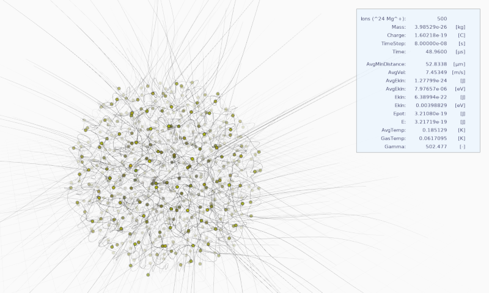

# sketches
[Processing v3](https://processing.org/) sketches.

## nbody
Prototype of an N-Body simulation of ion coulomb crystals. Requires [queasycam](https://github.com/jrc03c/queasycam) (just download and unzip it into sketchbook/libraries).

The velocities are damped exponentially (the higher the velocity the exponentially higher the damping force).
