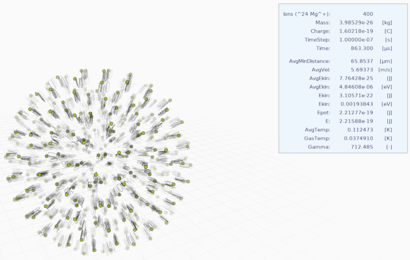

# sketches
[Processing v3](https://processing.org/) sketches.

## nbody
Prototype of an N-Body simulation of ion coulomb crystals. Requires [queasycam](https://github.com/jrc03c/queasycam) (just download and unzip it into sketchbook/libraries).

After a while the oscillation of the ions can be observed due to the harmonic potential and Coulomb potential.

